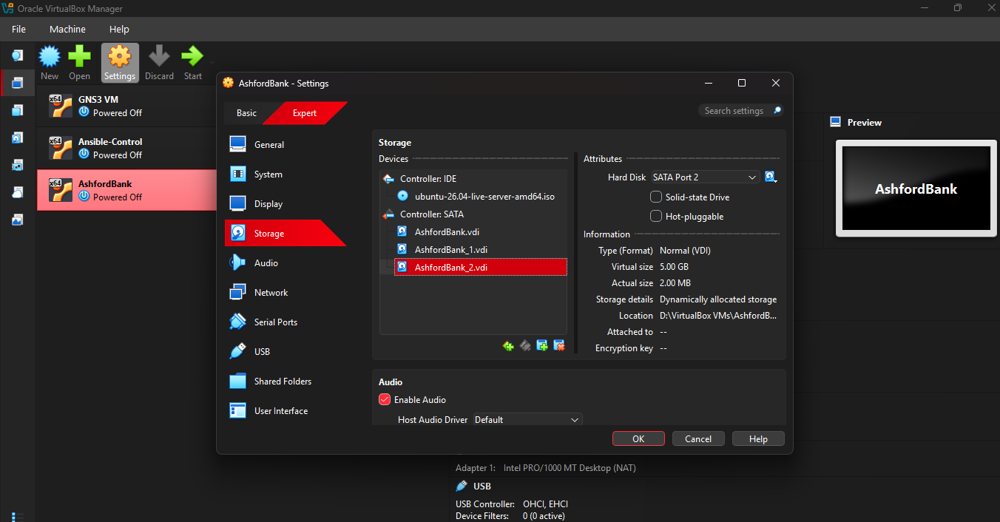
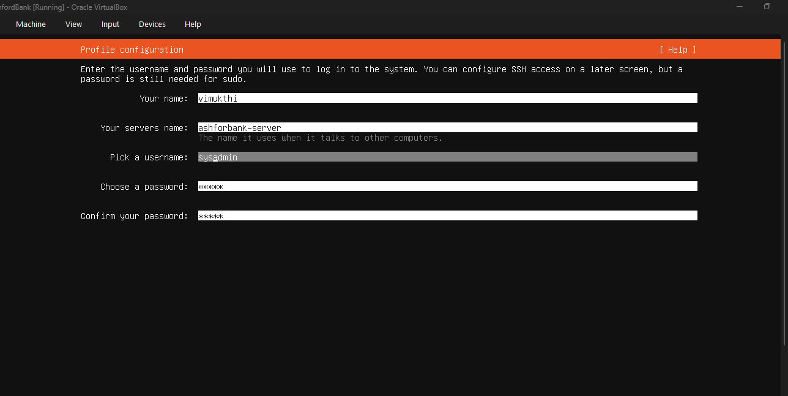
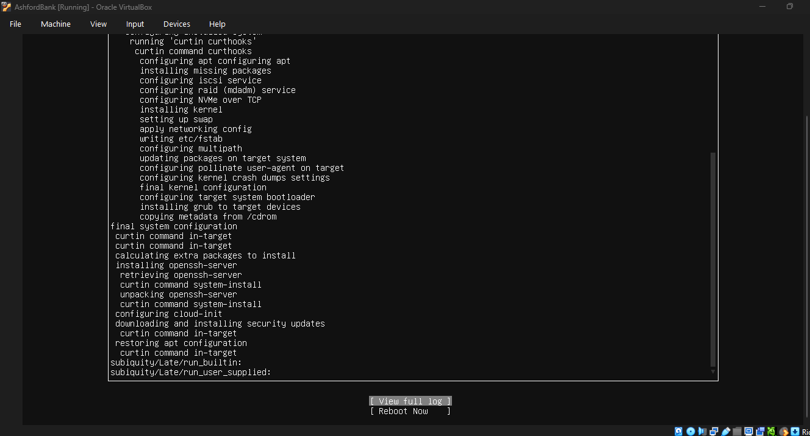

# Stage 1: Initial Server Build

Prepared by K.W.R. Dulakshana (KV), B.Tech in Network Technology, University of Vavuniya. Work started 21 July 2026.

## Purpose

This is the very first stage of the project: creating the virtual machine, installing the operating system, and logging in for the first time. Every decision here became the foundation that the later, more formal reports were built on. See screenshots/01_virtualbox_three_disks_attached.png, screenshots/02_ubuntu_profile_ssh_setup.png, and screenshots/03_installation_complete_reboot.png for real screenshots taken during this stage.

## Storage planning

The client's core requirement was to grow storage later without ever taking anything offline. Plain disk partitioning cannot do this cleanly, since resizing a fixed partition later is difficult or impossible. This is why the Linux Logical Volume Manager (LVM) approach was chosen instead. LVM has three building blocks:

1. Physical Volume (PV), which is simply a raw disk
2. Volume Group (VG), a pool of space formed by combining one or more disks
3. Logical Volume (LV), a flexible virtual partition carved out of that pool, which can be resized or grown later with zero downtime if another disk is added

The main operating system disk (25GB) was kept as a plain, ordinary partition, completely separate from LVM. Two additional disks were attached for Loans and Tellers data, and both were placed into the same Volume Group later on. The client never gave exact size numbers, only that loan document volume keeps increasing every quarter, so Loans was given the larger starting allocation of 10GB, and Tellers was given 5GB, since Tellers mainly stores smaller day to day transaction records.

## Building the virtual machine

The VM was created in VirtualBox with the name AshfordBank, 2048MB of RAM, 2 CPU cores (plenty for a server task with no heavy graphical interface), a 25GB main OS disk, a 10GB disk for Loans, and a 5GB disk for Tellers. See screenshots/01_virtualbox_three_disks_attached.png for the storage settings showing all three disks attached under the SATA controller.

Two separate additional disks were used on purpose, instead of one larger disk split logically, so that the real behaviour of extending a Volume Group with a brand new disk could actually be practiced later, matching what happens in a real production environment.

## Installing Ubuntu Server

During the guided storage step of the Ubuntu Server installer, a checkbox offering to set up the main disk as an LVM group was unchecked on purpose. If the operating system disk itself had LVM applied to it, later LVM commands could get confused between Ubuntu's own automatically created volume group and the bankvg group created manually for this project. Keeping the OS disk as a plain ext4 partition means LVM logic applies only and entirely to the two data disks.

During the profile and SSH configuration step, the hostname was set to ashfordbank-server and the admin username was set to sysadmin. The Install OpenSSH server option was enabled, and password authentication over SSH was allowed. See screenshots/02_ubuntu_profile_ssh_setup.png. SSH access was enabled specifically because typing directly into the small VirtualBox console window is awkward and copy paste does not work well there, so the plan from the start was to move to a full terminal on the Windows host machine as soon as possible.

No optional server snap packages were selected, to keep the install minimal and avoid running services that are not relevant to this project.

## First login

After the VM rebooted, the login prompt was reached and the sysadmin account logged in successfully. See screenshots/03_installation_complete_reboot.png. The system reported Ubuntu 26.04 LTS with an automatically assigned internal IP address.

## Known issue found here

The saved hostname came out as ashforbank-server, missing the letter d, instead of the intended ashfordbank-server. This did not block any further work, but it was flagged to be corrected before final handoff. The fix for this is documented in 05_hostname_fix_and_live_growth.md.

## What came next

From this point, the project moved on to creating the actual storage volumes, the department groups and user accounts, the folder permissions, and the password policy, all of which are documented in the following files in this docs folder.
