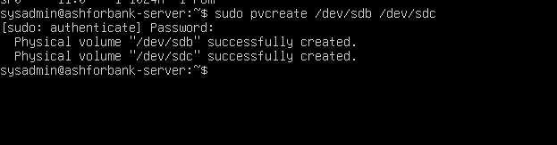
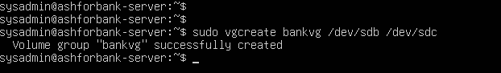
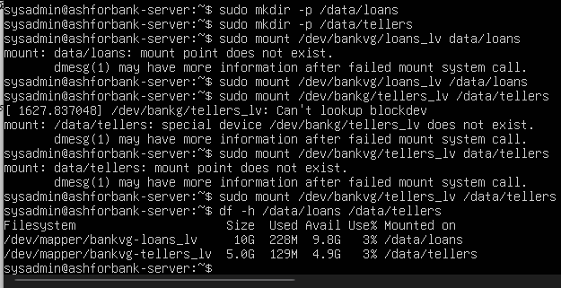
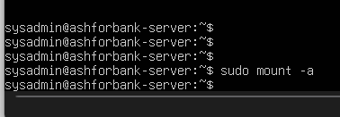
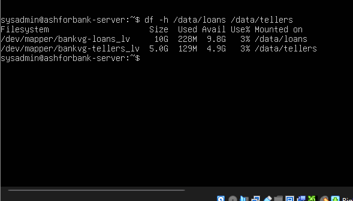

# Stage 2: LVM Storage Deployment

Prepared by K.W.R. Dulakshana (KV). This document covers the full build of the storage layer for both departments, together with reboot proof that it survives a restart.

## Goal

Build independent, resizable storage for the Loans and Tellers departments on the Linux server, using best practices for filesystem choice, persistent mounting, and reboot resilience. See screenshots/04_pvcreate_physical_volumes.png through screenshots/08_reboot_persistence_confirmed.png for real terminal screenshots taken during this stage.

## Requirements broken down

* Loans (loans_lv), 10GB, since this department stores large scanned PDF documents
* Tellers (tellers_lv), 5GB, since this department stores smaller transaction records

Both volumes came from a single shared Volume Group rather than two separate ones, specifically because the client said Loans will need more space later. A shared pool means free space can go to whichever department needs it next, instead of being permanently locked to one side.

## Steps performed

1. Confirmed both physical disks were visible to the operating system using lsblk
2. Created Physical Volumes on both disks using pvcreate, registering them with LVM. See screenshots/04_pvcreate_physical_volumes.png
3. Combined both Physical Volumes into a single Volume Group named bankvg using vgcreate, then verified its size with vgdisplay. See screenshots/05_vgcreate_volume_group.png
4. Created loans_lv at exactly 10GB and tellers_lv at exactly 5GB. Exact sizes were used instead of taking all remaining free space, specifically to preserve room for future growth without needing a new disk right away
5. Formatted both logical volumes with the XFS filesystem, chosen because XFS can be grown later while still mounted and actively in use, with no downtime at all
6. Created the mount point folders /data/loans and /data/tellers, then mounted both volumes and confirmed the sizes with df. See screenshots/06_df_h_mounted_volumes.png
7. Retrieved the UUID of each logical volume, then added persistent entries to /etc/fstab using those UUIDs rather than device paths, since device paths such as /dev/sdb can change after a reboot while a UUID stays constant
8. Ran mount all to test the new fstab entries immediately, without needing a reboot, since a syntax mistake in fstab can prevent a server from booting normally. See screenshots/07_mount_a_fstab_validation.png
9. Rebooted the server for real and confirmed both filesystems automatically remounted with no manual steps required. See screenshots/08_reboot_persistence_confirmed.png

## Mistakes made and fixed here

During logical volume creation, three related mistakes happened back to back, and all three are kept in the record on purpose:

1. A logical volume name was typed with a space in it instead of an underscore. LVM correctly rejected this, since it read the space as a volume group name that did not exist
2. A logical volume was created under a misspelled name because of a single letter typo. The wrongly named volume was removed with lvremove and recreated correctly
3. Creating the Tellers volume with all remaining free space failed at first, because the earlier typo mistake had already used up part of the pool. Once the extra logical volume was removed, the correct amount of free space was available and the command succeeded

The pattern across all three: LVM almost always fails loudly and immediately on a bad command, rather than silently doing something unintended, which makes mistakes like these easy to catch and fix quickly.

## Conclusion

The deployment met all three of the client's requirements at this stage. Each department has its own independent and appropriately sized logical volume, XFS allows either volume to be grown later without rebuilding the server, and the reboot test proves storage comes back online automatically with zero manual steps, even after a crash or restart.
