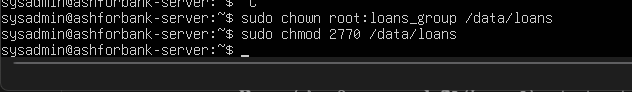
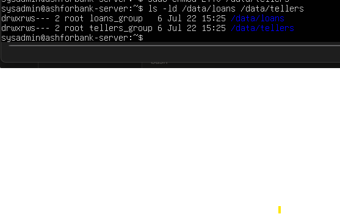
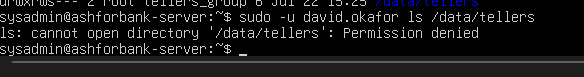
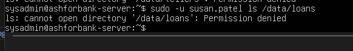

# Stage 3: Users, Groups, and Permission Isolation

Prepared by K.W.R. Dulakshana (KV). This document covers how each department was given its own private, isolated storage folder.

## Goal

Set up individual accounts for each department's team lead, David Okafor for Loans and Susan Patel for Tellers, with each account limited strictly to its own department's storage, and no way to browse into the other department's files. See screenshots/12_ownership_permissions_applied.png through screenshots/15_isolation_test_tellers_denied.png for real terminal screenshots taken during this stage.

## Design

Linux controls access to files using three groups of people: the owner, the group, and everyone else. Instead of granting access person by person, this design uses group based access control. loans_group is David Okafor's main group and owns /data/loans. tellers_group is Susan Patel's main group and owns /data/tellers.

Each department folder is owned by root, group owned by its own department group, and set to permission mode 2770. In plain terms, this means full access for the owner and the group, and zero access for absolutely everyone else, which is exactly what satisfies the client's requirement that nobody outside a team should be able to browse into it. The SGID bit (the leading 2 in 2770) makes sure that any new file created inside the folder automatically belongs to the correct department group forever, not just for the files that exist today.

A simple way to picture it: each department group is like a distinct key. Only people holding the loans_group key can open the Loans storage room. The tellers_group key opens a completely different room. Having one key never opens the other room.

## Steps performed

1. Created loans_group and tellers_group using groupadd
2. Created the david.okafor and susan.patel accounts using useradd, with each account's home directory automatically created and its primary group set to its own department group
3. Applied ownership and permission mode 2770 to both /data/loans and /data/tellers using chown and chmod. See screenshots/12_ownership_permissions_applied.png
4. Verified the resulting permission string with ls, confirming the SGID bit was switched on, that outsiders truly have zero access, and that group ownership matched each department correctly. See screenshots/13_permission_bits_verified.png

## Proving the isolation actually works

Rather than only trusting the permission settings on paper, a direct access test was run in both directions. David Okafor's account attempted to open /data/tellers, and Susan Patel's account attempted to open /data/loans. Both attempts correctly failed with a permission denied message, which is the good outcome here, since it proves cross department access is genuinely blocked and not just theoretically blocked. See screenshots/14_isolation_test_loans_denied.png and screenshots/15_isolation_test_tellers_denied.png.

## Mistakes made and fixed here

Five separate typing mistakes happened while setting this up, and all five are kept in the record on purpose, since noticing and correcting this kind of mistake is a completely normal part of real Linux administration work:

1. A group name typed with a space in it, which groupadd correctly rejected
2. A group name accidentally saved under a misspelled version because the final letter was left off. This succeeded silently, so it was only caught by checking the real group list with getent, then removing the wrong group and recreating it correctly
3. A user creation command that appeared not to run, because the terminal was only showing a greyed out autocomplete suggestion before Enter was pressed. This was resolved by checking the account's real status directly with the id command instead of trusting how the console looked
4. A username typed with a hyphen instead of the correct dot, which produced a no such user error until corrected
5. A user creation command for the second account that failed because two required flags were missing, and was simply retyped correctly

One clear pattern across all five mistakes: Linux almost always failed loudly and immediately on badly typed input, with one exception, the misspelled group name, which succeeded silently under the wrong name. That case is a good reminder of why it is worth double checking the real state of the system with commands like getent, id, and ls, rather than assuming a command worked just because it produced no visible error.

## Conclusion

Department based access control is fully in place and verified. Two department groups and two named user accounts exist, each restricted to its own department's storage folder, with the SGID bit guaranteeing that this stays true for every new file created in the future, not only for the files that exist right now.
