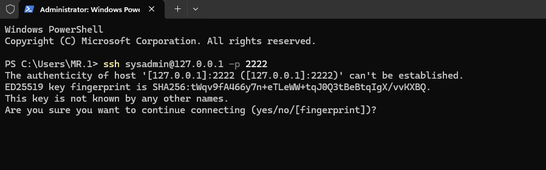
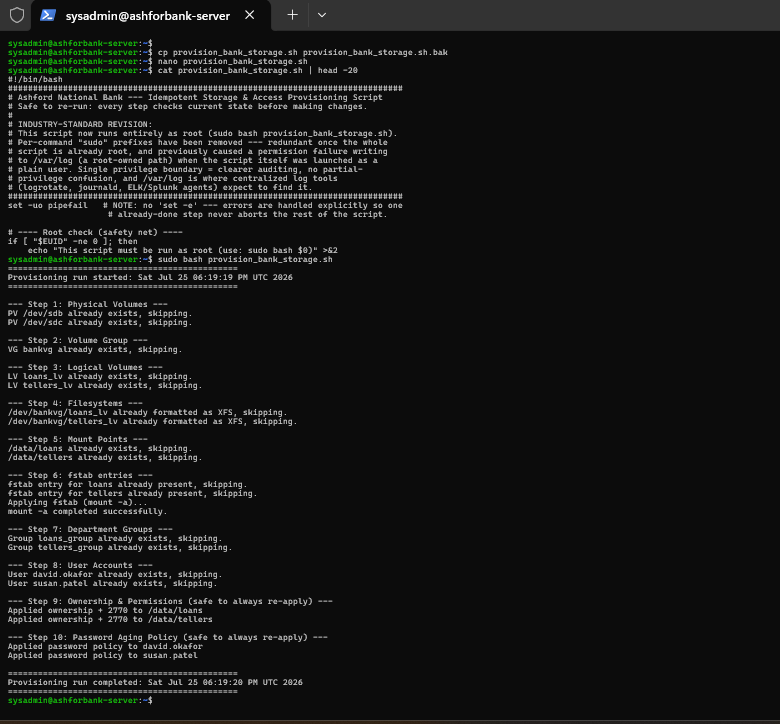

# Stage 4: SSH Access and the Idempotent Script

Prepared by K.W.R. Dulakshana (KV). This document covers setting up reliable remote access to the server, and turning the whole manual setup process into a single, safely repeatable script.

## Goal

Set up reliable SSH access from the Windows management machine into the virtual machine, and turn the entire previously manual Loans and Tellers setup process (storage, users, groups, permissions, password policy) into one script that can be run again at any time with no side effects. See screenshots/16_first_ssh_connection_success.png and screenshots/17_idempotent_script_clean_run.png for real terminal screenshots taken during this stage.

## Setting up remote access

A first SSH connection attempt from the Windows host reached the server's network port with no timeout, but the connection closed immediately before any password prompt appeared. This pointed to a problem at the service level rather than the network level.

Checking the SSH service directly on the VM showed it was inactive. Ubuntu ships SSH as socket activated by default, meaning the socket only starts the actual service on the very first connection attempt, and in this case the service had not come up automatically. Enabling and starting the SSH service directly fixed this.

A second connection attempt using the VM's internal address still could not be reached from the Windows host, which confirmed the remaining barrier was VirtualBox's network isolation, not the SSH service itself. A port forwarding rule was added, mapping host port 2222 to the guest's SSH port 22, which let the Windows host connect using the loopback address and that forwarded port. This produced a successful login, shown in screenshots/16_first_ssh_connection_success.png, and gave a full, reliable terminal on the Windows host for all further work, since the small VirtualBox console window makes copy paste unreliable.

## Building the idempotent script

The full manual sequence built up across storage, users, groups, permissions, and password policy was combined into a single script, provision_bank_storage.sh, organised into ten sequential steps. Every step follows the same pattern: check whether something already exists, and only create it if it does not. The ownership, permission, and password aging steps are safe to reapply every time without checking first, since chown, chmod, and chage always simply set a target state rather than adding to a previous one.

The script also writes its own console output to a log file, so every run is both shown live in the terminal and permanently saved for later review.

## Mistakes made and fixed here

1. The script's filename was accidentally shortened during a save in the nano text editor, because the terminal window cut off the visible file name in the save prompt before Enter was pressed. This was only caught by checking the real file listing directly, and fixed with a simple rename
2. The very first run of the script produced a permission denied error while trying to write its log file, because the script was launched as a normal user while individual commands inside carried their own separate sudo prefixes, but the log folder itself requires root access. The actual provisioning steps were unaffected, since each one already had its own sudo prefix; only the logging line failed
3. Rather than simply moving the log file somewhere else to avoid that error, the script was refactored to run entirely as root from the very start, matching how real production tools such as Ansible and cloud init are normally run. Every individual sudo prefix inside the script was removed, and the script now begins with an explicit check that stops immediately with a clear message if it is not run as root

## Proving the script actually works

The script was run twice in a row, both before and after the root only refactor. Every single time, every step correctly reported that its target already existed and was simply skipped, with no errors and no unwanted side effects, which is direct, repeatable proof that running the script by accident a second time will never break anything. See screenshots/17_idempotent_script_clean_run.png for the clean run after the refactor.

## Conclusion

Remote administration is now reliable, using SSH through a port forwarding rule rather than the awkward VirtualBox console. The full manual setup process has been captured in a single script that is genuinely safe to run again at any time, satisfying the client's clear requirement that running it twice by accident must never break anything.
