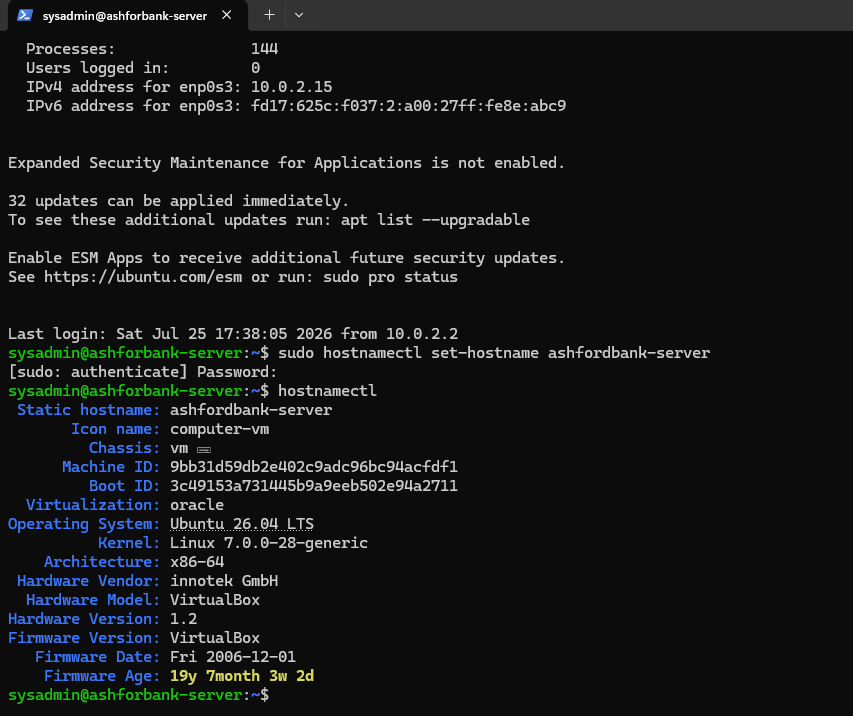
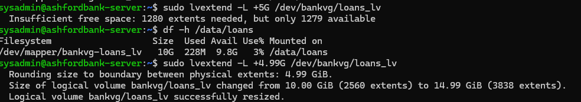
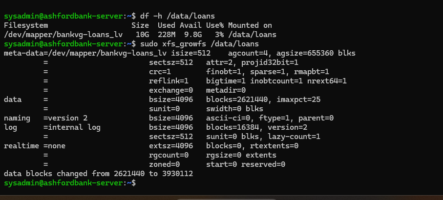

# Stage 5: Hostname Fix and Live Storage Growth Proof

Prepared by K.W.R. Dulakshana (KV). This document covers the final two outstanding items from the build: fixing a hostname typo, and proving, through a real live demonstration rather than just a design claim, that the bank's storage can grow on demand without taking any department offline.

## Goal

Fix the hostname typo found during the very first installation, and directly prove that storage allocated to the Loans department can grow later without rebuilding the server or taking that department's folder offline, addressing the client's stated concern that loan document volume keeps increasing every quarter. See screenshots/09_hostname_fixed_confirmed.png, screenshots/10_lvextend_loans_volume_grown.png, and screenshots/11_xfs_growfs_live_filesystem_grow.png for real screenshots taken during this stage.

## Fixing the hostname

The hostname is stored in two places that both need to agree: the live system hostname, set using hostnamectl, and a static entry inside /etc/hosts that lets the server resolve its own name locally. The static hostname was corrected first using hostnamectl set hostname. Checking /etc/hosts afterward showed the old, misspelled entry was still sitting there, since hostnamectl only updates the live hostname and does not touch this file on its own. The file was corrected directly, and the fix was confirmed from a brand new SSH session rather than trusting an already open session, since an existing session does not automatically refresh its own prompt. See screenshots/09_hostname_fixed_confirmed.png.

## Proving live storage growth

The proof was set up to mirror a realistic future scenario: a brand new virtual disk was added to the server and absorbed into the existing storage pool, following the same three layer LVM approach used earlier in the project.

1. The VM was shut down cleanly and a new 5GB disk was attached through VirtualBox's storage controller, since this kind of hardware level change requires the VM to be powered off first
2. The new disk was registered as a Physical Volume, then added to the existing bankvg Volume Group, growing the shared pool
3. The Loans logical volume was extended to take in the newly available free space, growing it from 10GB toward roughly 15GB
4. The XFS filesystem sitting on top of the Loans volume was then grown separately, in place, while the folder stayed mounted and in active use the entire time

That last point is the whole reason XFS was chosen from the beginning: growing a logical volume's raw size and growing the filesystem that lives on top of it are two separate operations, and XFS can do the filesystem step live, with no need to unmount anything first. See screenshots/10_lvextend_loans_volume_grown.png and screenshots/11_xfs_growfs_live_filesystem_grow.png.

## A mistake made and fixed here

The first attempt to grow the Loans volume by exactly 5GB failed, because the new disk's usable space came out very slightly under 5GB once LVM's internal extent rounding was accounted for, so an exact request could not be met. The corrected command asked for a slightly smaller, rounding safe amount instead, which succeeded immediately.

Checking the mounted filesystem right after the logical volume was extended, and before the filesystem itself was grown, deliberately showed the old, smaller size still being reported. This demonstrates clearly that resizing a logical volume and resizing the filesystem on top of it truly are two separate steps, each needing its own command.

## Conclusion

The hostname is now consistently correct in both places it is stored. More importantly, the client's original storage requirement, the ability to grow storage later without rebuilding the server or taking any department offline, has now been proven directly rather than only claimed as a design property. A new disk was attached, absorbed into the pool, and used to grow the Loans volume live while it stayed mounted and in use the whole time, with zero downtime at any point.
