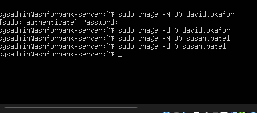
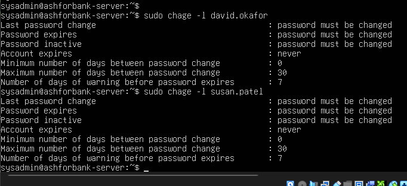

# Stage 6: Password Aging Policy

Prepared by K.W.R. Dulakshana (KV). This document covers how password security rules were applied to the two staff accounts. See screenshots/18_chage_commands_applied.png and screenshots/19_chage_verification_output.png for real terminal screenshots taken during this stage.

## The client's requirement

The client's message was clear and direct: staff passwords should be forced to change on first login and expire automatically every 30 days, so nobody on the IT side has to chase people down about it manually. This breaks down into two separate rules:

1. Force a password change the very first time each account logs in
2. After that, make the password expire automatically every 30 days, with no IT staff needing to track dates or send reminders

## The tool used: chage

Linux has a built in command called chage, short for change age, that controls how long a password is allowed to live before it must be changed. It does not touch the password itself, only the rules around it. Two flags did all the work here:

* -M 30 sets the maximum password age to 30 days. Once 30 days pass since the last change, the account is forced to set a new password at the next login
* -d 0 sets the last changed date to day zero (1 January 1970). This is a standard trick that tells Linux this password has never really been set by the user, which forces a password change the very next time they log in

Using -M 30 together with -d 0 solves both requirements in a single step. The account is immediately marked as needing a new password, covering the first login rule, and the moment that new password is set, a 30 day countdown starts on its own, with no cron job, script, or manual reminder required.

## Commands used

```
sudo chage -M 30 david.okafor
sudo chage -d 0 david.okafor
sudo chage -M 30 susan.patel
sudo chage -d 0 susan.patel
```

All four commands finished with no error messages. In Linux, this silence is actually a good sign, since most command line tools only print something when there is a problem, so no output means the command worked. See screenshots/18_chage_commands_applied.png.



## Verifying it actually worked

Rather than trusting that the four commands above did what they were supposed to, each account's real settings were checked directly using chage l. Both accounts showed the exact same result: the password must be changed at next login, the account never expires, the minimum days between password changes is 0, the maximum days between password changes is 30, and a warning is given 7 days before expiry. See screenshots/19_chage_verification_output.png.



The password must be changed status is the direct result of the -d 0 flag, and it proves the account will genuinely be forced to set a new password the next time someone logs in. The 30 shown for maximum days confirms the automatic 30 day expiry is active and working correctly.

## Conclusion

Both staff accounts, david.okafor and susan.patel, now follow the bank's password policy without any need for IT staff to monitor them by hand. A new password is required on first login, and afterward passwords expire automatically every 30 days. This was confirmed by directly reading each account's real settings with chage l, rather than only assuming the earlier commands had worked.

One thing worth carrying forward for whoever manages this server next: this policy has to be applied per account, so any new staff member added later in Loans or Tellers will need the same two commands run for them. This is exactly why the password policy step was later folded into the idempotent provisioning script covered in the next document, so it never has to be applied by hand again.
